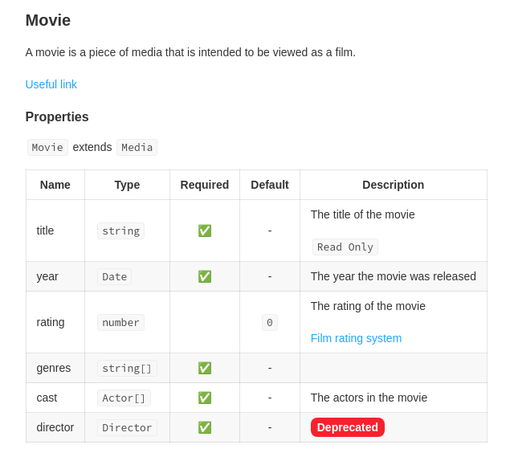

# ts2doc

Ts2doc is a tool to generate documentation from TypeScript exported declarations (interfaces, classes, functions, etc.).

For now it can be used as a **storybook addon**.

If you like this project, please give it a star ⭐️

## Install storybook addon

```sh
npm install --save-dev @ts2doc/storybook-addon
```

## Example

Given the following TypeScript interface:

```ts
/**
 * A movie
 */
export interface Movie {
    readonly title: string;
    rating?: number;
    genres: string[];
    /**
     * The actors in the movie
     */
    cast: Actor[];
    /**
     * The director of the movie
     */
    director: Director;
}
```

Will be displayed as:



## Usage

To display the example above, you need to:

### Setup storybook addon

In your `main.js` file:

```js
/* .storybook/main.js */

module.exports = {
    addons: [
        // ... other addons
        {
            name: '@ts2doc/storybook-addon',
            options: {
                patternDocType: 'src/**/*.ts',
                compilerOptions: {} // Optional
            }
        }
    ]
};
```

**patternDocType:**

The pattern to find the files to document, using [glob](https://www.npmjs.com/package/glob) syntax. The pattern will be resolved from your project root.

**compilerOptions:**

Optional. The compiler options to use to parse the files. If not provided, the default compiler options will be used.
See [compiler options](https://www.typescriptlang.org/docs/handbook/compiler-options.html) for more information.

### Write your stories

In your `.mdx` file, to document a TypeScript exported declaration:

**/!\ It only works with `.mdx` files**

```js
/* src/movie.stories.mdx */

import { Meta } from '@storybook/addon-docs';
import { InterfaceDoc } from '@ts2doc/components';
// Always import the doc.json file with the following path
import doc from '.cache/ts2doc/doc.json';

<Meta title="Docs/Interfaces" />

<InterfaceDoc doc={doc.Movie} />
```

The `doc` variable is the content of the `doc.json` file generated by the addon in your `node_modules` folder at `node_modules/.cache/ts2doc/doc.json`.

**Title:**

If you want to update the title of the `Doc`, you can use the `title` prop:

```js
import { InterfaceDoc } from '@ts2doc/components';
// ...
<InterfaceDoc doc={doc.Movie} title="Movie" />;
```

**Description:**

If you want to update the description of the `Doc`, you can use the `description` prop:

```js
import { InterfaceDoc } from '@ts2doc/components';
// ...
<InterfaceDoc doc={doc.Movie} description="Some description" />;
```

## More examples

More examples can be found in the [examples](examples/storybook-app/) folder.

## Supported declarations

| Declaration | Supported |
| ----------- | --------- |
| `interface` | ✅        |
| `variable`  | ❌        |
| `function`  | ❌        |
| `type`      | ❌        |
| `enum`      | ❌        |
| `class`     | ❌        |
| `namespace` | ❌        |

## Roadmap

-   [x] Add support for `interface`
-   [ ] Add support for JSDoc `@type`
-   [ ] Add support for JSDoc `@link`
-   [ ] Add support for JSDoc `@default`
-   [ ] Add support for `variable`
-   [ ] Add support for `enum`
-   [ ] Add support for `type`
-   [ ] Add support for `function`
-   [ ] Add support for `class`
-   [ ] Add support for `namespace`

If you want to contribute, feel free to open an issue or a PR.

## Contributing

Any contributions you make are greatly appreciated.

1. Fork the Project
2. Create your Feature Branch (`git checkout -b feature/AmazingFeature`)
3. Commit your Changes (`git commit -m 'Add some AmazingFeature'`)
4. Push to the Branch (`git push origin feature/AmazingFeature`)
5. Open a Pull Request

## Development

### Install dependencies

```sh
npm ci
```

### Build addon

```sh
npm run build
```

### Start storybook app

```sh
npm start
```

### Lint

```sh
npm run lint
```

### Test

```sh
npm test
```

## License

Distributed under the `MIT` License. See `LICENSE` file for more information.
